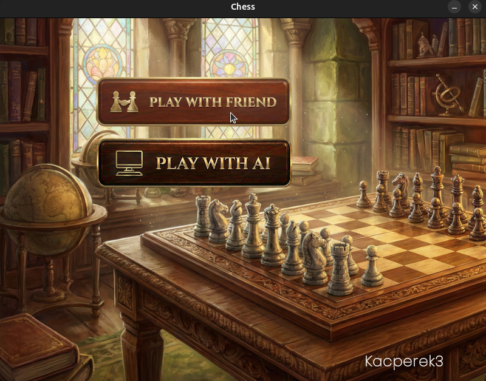
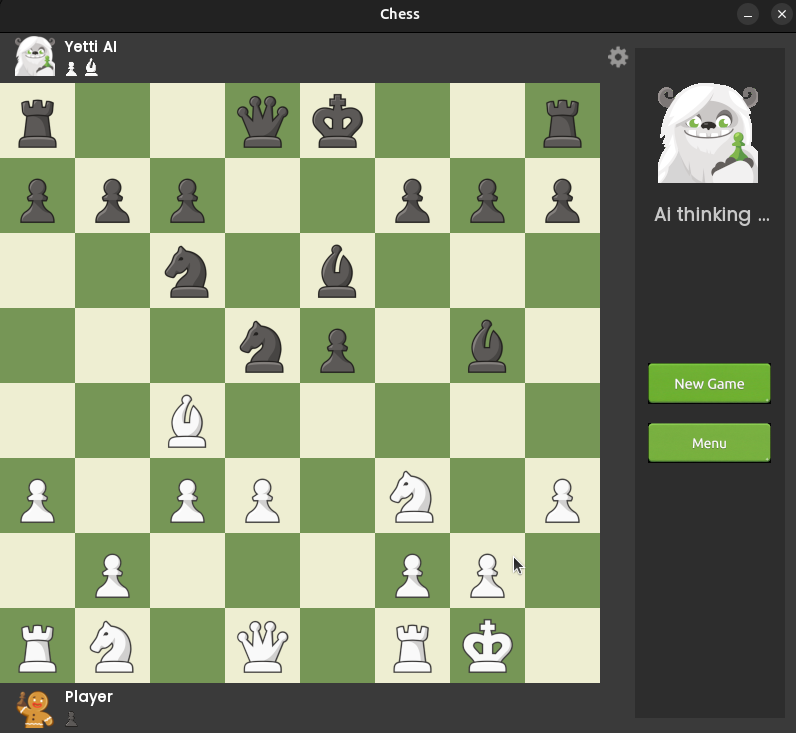
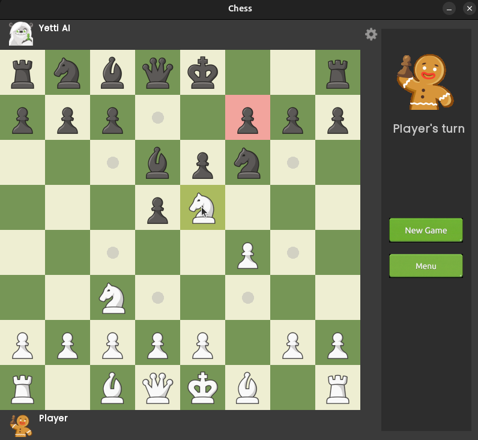
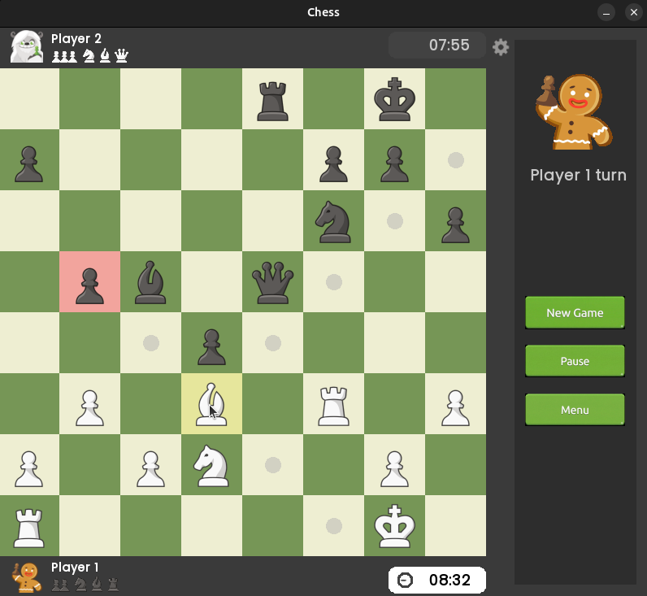
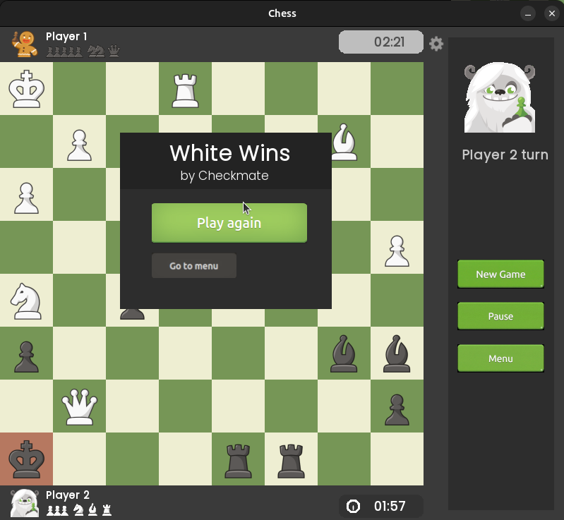

<h1 align="center">Modern C++ Chess Engine</h1>

<p align="center">
  A high-performance, multithreaded Chess application built with <strong>C++</strong> and <strong>SFML</strong>.<br>
  Featuring a ~1500 ELO Engine and a polished UI inspired by Chess.com.
</p>

<p align="center">
  
  
  
  
</p>

---

##  Features

* **Intelligent AI:** Custom chess engine playing at approximately **1500 ELO**. Capable of challenging intermediate players.
* **Multithreaded Architecture:** The AI calculates moves on a separate thread, ensuring the **GUI remains buttery smooth** (60 FPS) even while the computer is thinking.
* **Interface:** Clean, modern visual design inspired by standard platforms like Chess.com.
* **Game Modes:**
    * **Player vs. AI:** Challenge the engine.
    * **Local PvP:** Play against a friend on the same computer.
* **Easy Build System:** simple script included to compile and run instantly.

---

##  Screenshots

### Main Menu
<p align="center">
  
  <br>
</p>

### Player vs AI (Engine)
<p align="center">
  
  &nbsp; 
  <br>
  <em>Challenging the 1500 ELO engine while maintaining smooth 60 FPS.</em>
</p>

### Local PvP (Play with Friend)
<p align="center">
  
  &nbsp;
  
  <br>
  <em>Classic hot-seat mode for playing against a friend locally.</em>
</p>

> *The interface is designed for clarity.*

---

## ️ Installation & Building

This project uses **CMake** for building. I have provided a simple helper script to automate the process for you.

### Prerequisites
* **Linux:** `g++`, `cmake`, `libsfml-dev`
* **Windows:** Visual Studio (with C++) or MinGW, and CMake.

###  The "One-Click" Run (Recommended)

1.  Clone the repository:
    ```bash
    git clone https://github.com/Kacperek3/Async-Chess.git 
    cd Async-Chess
    ```

2.  Run the build script:
    ```bash
    # Make the script executable (Linux/Mac only)
    chmod +x build_and_run.sh

    # Build and Run in Release mode (Optimized for AI speed)
    ./build_and_run.sh Release
    ```

**That's it!** The script will automatically configure CMake, compile the source code, and launch the game.

---

##  Technical Details

For developers interested in the architecture:

* **Engine Logic:** Uses Minimax algorithm with Alpha-Beta pruning for move searching.
* **Threading:** The heavy lifting of the AI search is decoupled from the rendering loop using `std::thread`, preventing "Not Responding" freezes during deep searches.
* **Asset Management:** Resources (textures, fonts) are loaded via a central Resource Manager to ensure memory efficiency.

---

##  Controls

* **Mouse Left Click:** Select a piece to move, or click and hold to drag.
* **Mouse Right Click:** Cancel drag (returns the piece to its original square).
* **Esc:** Open Menu.

---


##  Work in Progress

This project is currently under active development.

**Roadmap:**
*  **LAN Multiplayer:** Support for playing against friends over the local network is coming soon.
* Further engine optimizations.

---

##  License

This project is licensed under the MIT License - see the [LICENSE](LICENSE) file for details.